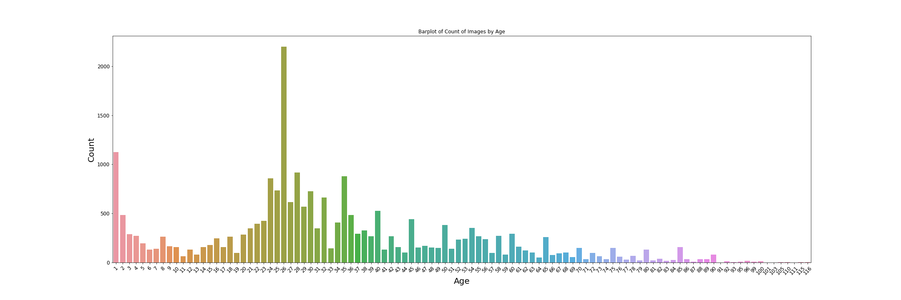
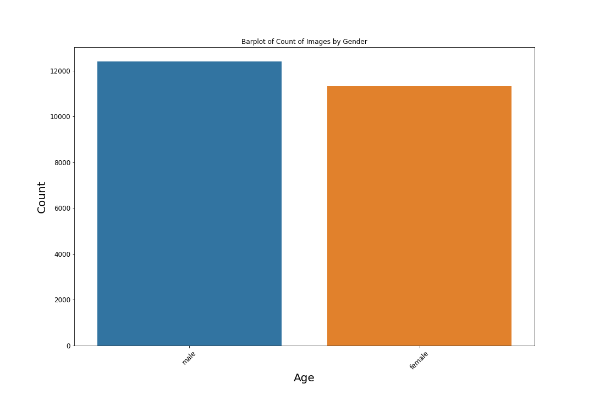
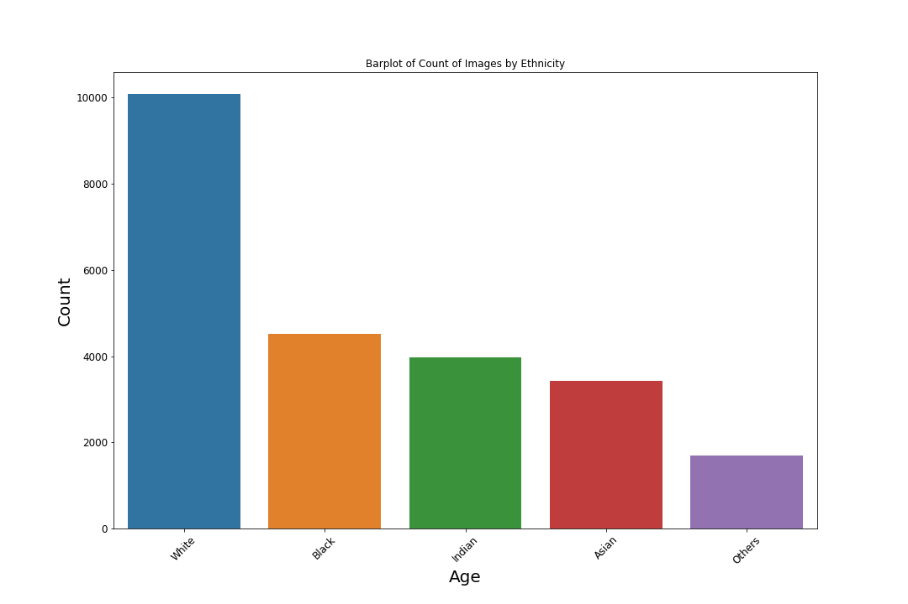
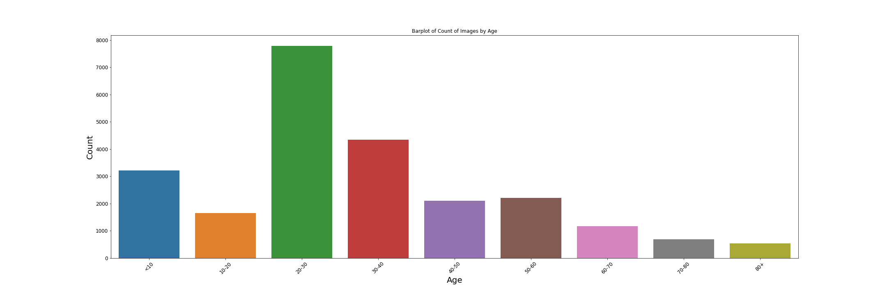
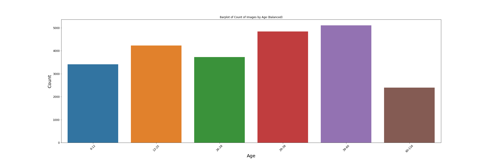
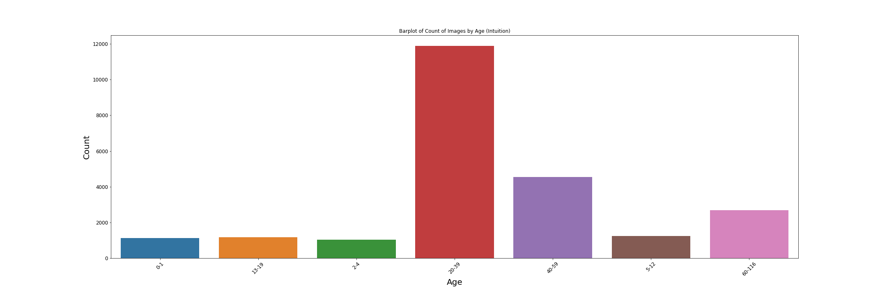

# Capstone: Age and Gender Classification using Convolutional Neural Networks

## Contents  

- [Background](#Background)
- [Problem Statement](#Problem-Statement)
- [Dataset](#Dataset)
- [Research](#Research)
- [Findings](#Findings)
- [Evaluating Models & Datasets](#Evaluating_Models_&_Datasets)
- [Fine Tuning](#Fine_Tuning)
- [Final Model](#Final_Model)
- [Conclusions](#Conclusion)
- [Further Improvements](#Further_Improvements)

## Background

Facial analysis from images has many use cases like better ad targetting, content recommendation systems, security surveillance and many more. These tools make it easier to work with customers of all sorts and cater to their needs better. 

Of these attributes, the age and gender are the very basic of facial analysis and a required step for building a model for these use cases. However, its not an easy task as even as humans, our guess work is based on looks and its not easy as we look at people of the same age differently. 

Factors like how well they care for their skin, genetics and race could cause people not to age the same way. 

To attempt to solve this, using CNN has been the most preferred model for computer vision tasks and have proven to be the most effective at dealing with image datasets.

## Problem Statement  

Our client is a company that owns shopping malls. They would like to understand the demographics of customers entering their shop, so that they can cater to the shoppers needs better.

Hence, our company was engaged by them to create a solution to identify their daily unique customers.

Hence, in this project, I'll be exploring gender and age prediction using deep learning. In short, traning a CNN(convolutional neural network) that will predict the age group and gender from a dataset of images containing the face of a person.

## Dataset

* Consists of 23708 face images
* Aligned and cropped faces
* Images are labelled by age, gender and ethnicity
* [age] is an integer from 0 to 116, indicating the age
* [gender] is either 0 (male) or 1 (female)
* [race] is an integer from 0 to 4, denoting White, Black, Asian, Indian, and Others (like Hispanic, Latino, Middle Eastern).
* Downloaded from [UTKFace Dataset](https://www.kaggle.com/jangedoo/utkface-new) as a .tar file

## Research

Through researching various articles, videos, GitHub links and research papers, these are the consolidated top findings.

*   Architecture
> * *TensorFlow backend for keras* to design the model as it provides the necessary helper functions to load, train, test and evaluate the model.  
> * *Numpy* and *Pandas* used to load CSV files, clean and manage the dataset
> * *Matplotlib* and *Seaborn* will be used for plotting and displaying information

*   Dataset
> * The dataset we will use to train our model is the UTKFace dataset, which contains 237008 images of faces in the JPG format of size 200x200 pixels, which will be downloaded from the kaggle database
        
 

# Findings

## EDA on Age

We can observe that the data set is not equally distributed and not all ages are represented. 

## EDA on Gender

For both the female and male samples, we have a good balanced number of images, so we should have a great accuracy for both classes when using our models.

## EDA on Ethnicity

From the plot, we can see that almost half of the samples are white, while the other ethnicities are alot smaller, which could lead to a smaller accuracy for their images.

## Classifying Age Dataset

We are interested to split the dataset into classes, with the aim of having a high accuracy, regardless of number of classes. Hence, for comparison, I have decided to create 3 different datasets, each with different numbers classes and considerations

### Bin size of 10

### Balanced 

### Intuition

# Evaluating Models & Datasets
I will be evaluating 2 base models (CNN & VGG16), and the 3 classified datasets. The end goal is to identify which model and dataset has the best accuracy, loss, with minimal missclassification. The model will be then used for optimization.

### Evaluating Loss and Accuracy of Models
|Model|Dataset|Images|Epochs|Train_Loss|Test_Loss|Train_Acc|Test_Acc| 
|:-:|:-:|:-:|:-:|:-:|:-:|:-:|:-:|
Base CNN|Bin10|Gray|14 of 30|1.7111|1.6766|38.20%|38.68%
Base CNN|Bin10|Color|30 of 30|1.3527|1.4037|47.06%|45.40%
Base CNN|Balance|Gray|17 of 30|1.2528|1.307|47.06%|44.52%
Base CNN|Balance|Color|21 of 30|1.1665|1.2509|50.83%|45.89%
Base CNN|Intuition|Gray|17 of 30|1.2762|1.2723|53.21%|54.56%
Base CNN|Intuition|Color|26 of 30|0.8850|1.0085|65.41%|62.31%
VGG16|Bin10|Color|30 of 30|0.2917|2.7957|88.50%|51.60%
VGG16|Balance|Color|30 of 30|0.3951|1.8146|83.13%|52.35%
VGG16|Intuition|Color|30 of 30|0.0907|1.6325|96.66%|70.05%

Above shows the evaluation for all the models thus far. The **VGG16 model** with **Intuition Classified** dataset had the highest accuracy, yet it was extremely overfitted. 

This model & dataset was selected for optimization.

# Fine Tuning
With fine tuning, I intend to look at
* Optimize hyperparameters by adding regularization
* Observe different batch size, resize images, learning rates
* Retrain the last convolutional and classification layer

|Resize|Epochs|Train_Loss|Test_Loss|Train_Acc|Test_Acc| 
|:-:|:-:|:-:|:-:|:-:|:-:|
224x224|7 of 30|0.4466|0.8188|82.39%|70.98%

|Batch Size|Epochs|Train_Loss|Test_Loss|Train_Acc|Test_Acc| 
|:-:|:-:|:-:|:-:|:-:|:-:|
64|4 of 30|0.5531|0.9092|77.92%|68.58%
128|5 of 30|0.4955|0.8936|79.88%|69.76%
256|6 of 30|0.4057|0.8927|84.06%|70.31%
512|9 of 30|0.4015|0.8205|84.09%|70.45%

|Learning Rate|Epochs|Train_Loss|Test_Loss|Train_Acc|Test_Acc| 
|:-:|:-:|:-:|:-:|:-:|:-:|
0.00001|21 of 30|0.2435|1.8192|91.29%|66.41%
0.0001|6 of 30|0.1404|1.2777|95.27%|67.48%
0.0005|6 of 30|0.3016|0.9377|88.27%|70.42%
0.001|6 of 30|0.4569|0.8088|81.72%|70.80%
0.01|9 of 30|0.9638|1.0427|63.56%|60.90%

|Layers|Epochs|Train_Loss|Test_Loss|Train_Acc|Test_Acc| 
|:-:|:-:|:-:|:-:|:-:|:-:|
Unfreeze 1|7 of 30|0.6174|0.9234|75.13%|68.00%
Unfreeze 2|27 of 30|0.4587|0.7896|82.73%|70.48%
Add Global Avg Pool|30 of 30|0.6666|0.7313|73.61%|71.35%

# Final Model

|Epochs|Train_Loss|Test_Loss|Train_Acc|Test_Acc| 
|:-:|:-:|:-:|:-:|:-:|
80|0.4900|0.6749|80.69%|74.34%

Final Model was trained for 80 epochs, and managed to get a better classification metric score for misclassifications of actual 13-19

# Conclusion
* Getting from an accuracy of 38.68% to 74.34% was no easy feat. I assumed that each parameter is independent of each other, hence taking an iterative approach towards a better score. But I've learned that the hyperparameters were not independent of each other, and there would be a better way to approach training the model
* Transfer learning from the VGG16 model immediately performed better than the base CNN model. It also trains faster as the weights have already be initialized.
* Model is sensitive to small changes, especially for classes with small datasets. 

# Further Improvements

* As the classes with more data trained better generally, I would add more image datasets to complement the current, believe it would yield better results.

* Use the tensorboard to compare the accuracy and loss plots. It will also allow me to deep dive into the layers that matter.

* Train data on more advanced models that are better than VGG16. Also, possibly train on advanced models that have similar dataset with UTKFace.

* Preprocess the training data, to make data similar to original model's train dataset. 

# Gif

